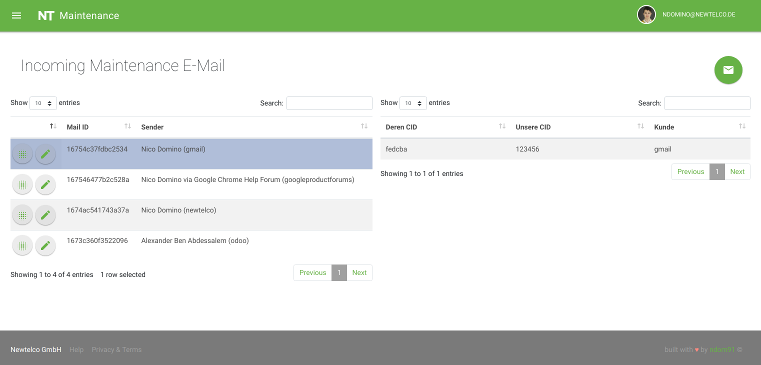

## Newtelco Maintenance Web App
---
#### Author: ndomino
#### Initial Launch: TBA

### [https://maintenance.newtelco.de](https://maintenance.newtelco.de)

   

### Intro

This PHP-based web application came to be due to a need to modernize our maintenance forwarding system. We were previously using many excel/google sheets, and our mailboxes in order to coordinate 3+ people to read and forward maintenance notifications to the correct customers.

This led to way too many instances of miscommunication which ultimately led to customers being misnotified of scheduled maintenances or worst of all - not being notified at all!

### Requirements

1) G Suite Account @ newtelco  
2) SQL DB  
3) PHP 7.0+ and Nginx or Apache

### Installation

1) Clone this repo  
2) Set your web server to point to index.php  
3) Enjoy!
