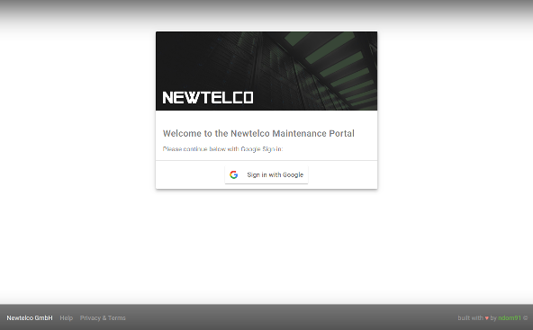
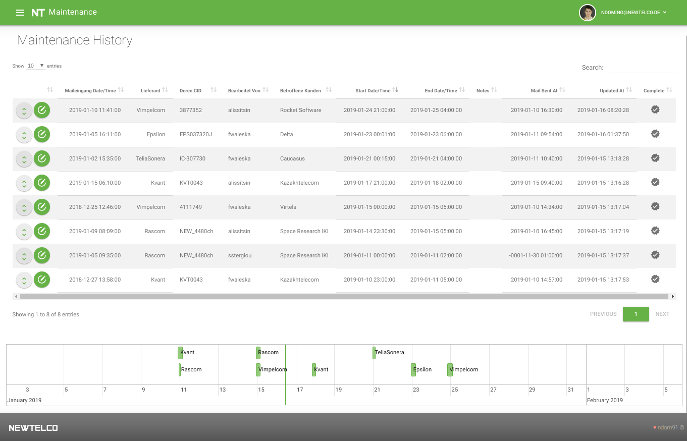

## Newtelco Maintenance Web App
---
#### Author: [ndomino](https://github.com/ndom91)

### [https://maintenance.newtelco.de](https://maintenance.newtelco.de)

   

### Intro

Newtelco Maintenance Web Application, designed and developed in-house, to replace Excel Tables + Emails back and forth.

### Requirements

1) G Suite Account @ newtelco  
2) SQL
3) PHP 7.0+ and Nginx or Apache

#### Tested On:

- MariaDB 10.1.34
- PHP 7.1.25
- Apache 2.4.29

### Installation

1) Clone this repo  
2) Run install.sh
3) Create database
3a) `sudo mysql -u[user] -p maintenancedb < configs/create_maintenanceDB.sql`
4) Copy Apache Configs from configs/apache2 to your apache sites config (on Ubuntu @ /etc/apache2/sites-enabled)
5) Restart Apache, on systemd based distrobutions `sudo systemctl restart apache2` on init.d `sudo service apache2 restart`
6) Enjoy!

### To Dos:

1) Generalize install.sh script
2) Clean-up minor bugs
3) Improve DB performance
4) Double check serviceworker behavior
